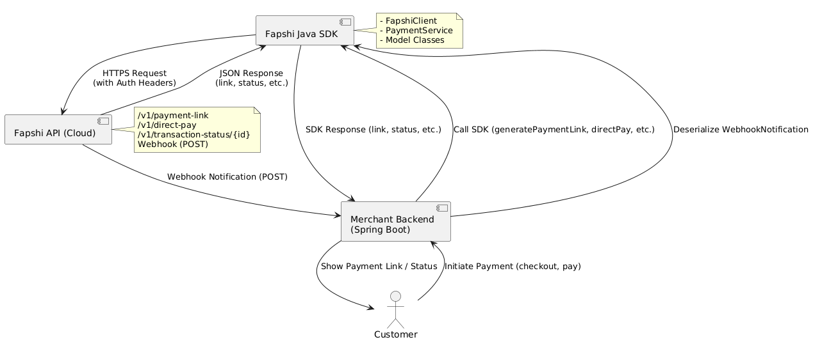

# Fapshi Java SDK

Java SDK for integrating with the [Fapshi Payment API](https://docs.fapshi.com/en/api-reference/getting-started).

## Workflows


[](https://github.com/iinsys/fapshi-java-sdk/network/updates)
[](https://snyk.io/test/github/iinsys/fapshi-java-sdk)


## 🔄 Dependency Management

- 🛠️ **Dependabot**: Automatically checks for dependency updates via [`.github/dependabot.yml`](.github/dependabot.yml)
- 🤖 **Renovate**: Alternative to Dependabot for custom and bulk PRs (configurable via `renovate.json`)

## Features
- Generate payment links
- Direct mobile money payments (MTN, Orange)
- Check transaction status
- Handle webhook notifications

## Requirements
- Java 21+
- Maven

## Installation

Add the following to your Maven `pom.xml` to use the latest release from JitPack:

```xml
<repository>
  <id>jitpack.io</id>
  <url>https://jitpack.io</url>
</repository>
<dependency>
  <groupId>com.github.iinsys</groupId>
  <artifactId>fapshi-java-sdk</artifactId>
  <version>v1.0.0</version>
</dependency>
```

## Configuration

```java
import com.fapshi.sdk.FapshiConfig;
import com.fapshi.sdk.FapshiClient;

FapshiConfig config = new FapshiConfig(
    "YOUR_API_KEY",
    "YOUR_API_USER",
    "https://api.fapshi.com"
);
FapshiClient client = new FapshiClient(config);
```

## Generate Payment Link Example

```java
import com.fapshi.sdk.model.PaymentLinkRequest;
import com.fapshi.sdk.model.PaymentLinkResponse;
import com.fapshi.sdk.service.PaymentService;

PaymentService paymentService = new PaymentService(client);

PaymentLinkRequest request = new PaymentLinkRequest();
request.setAmount(1000);
request.setCurrency("XAF");
request.setDescription("Order #1234");
request.setCustomerName("John Doe");
request.setCustomerEmail("john@example.com");
request.setCustomerPhone("2376XXXXXXX");
request.setCallbackUrl("https://yourdomain.com/payment-callback");

PaymentLinkResponse response = paymentService.generatePaymentLink(request);
System.out.println("Payment Link: " + response.getLink());
```

## Direct Payment Example (MTN/Orange)

### Minimal Example (Required Fields Only)

```java
import com.fapshi.sdk.model.DirectPaymentRequest;
import com.fapshi.sdk.model.DirectPaymentResponse;

DirectPaymentRequest directRequest = new DirectPaymentRequest();
directRequest.setAmount(1000); // required
directRequest.setPhone("237670000000"); // required

DirectPaymentResponse directResponse = paymentService.initiateDirectPayment(directRequest);
System.out.println("Direct Payment Status: " + directResponse.getStatus());
```

### Full Example (All Optional Fields)

```java
DirectPaymentRequest directRequest = new DirectPaymentRequest();
directRequest.setAmount(2000); // required
directRequest.setPhone("237690000000"); // required
directRequest.setName("Jane Smith"); // optional
directRequest.setEmail("jane@example.com"); // optional
directRequest.setMedium("mobile money"); // optional
directRequest.setUserId("user-123"); // optional
directRequest.setExternalId("order-5678"); // optional
directRequest.setMessage("Order #5678 payment"); // optional

DirectPaymentResponse directResponse = paymentService.initiateDirectPayment(directRequest);
System.out.println("Direct Payment Status: " + directResponse.getStatus());
```

## Check Transaction Status Example

The response will now include all fields as per the Fapshi API documentation:

```java
import com.fapshi.sdk.model.TransactionStatusResponse;

String transactionId = "txn_abc123";
TransactionStatusResponse status = paymentService.getTransactionStatus(transactionId);
System.out.println("Transaction Status: " + status.getStatus());
System.out.println("Transaction ID: " + status.getTransId());
System.out.println("Amount: " + status.getAmount());
System.out.println("Medium: " + status.getMedium());
System.out.println("Payer Name: " + status.getPayerName());
// ... print other fields as needed
```

### Transaction Status Response Fields

| Field             | Type    | Description                                  |
|-------------------|---------|----------------------------------------------|
| transId           | String  | Transaction ID                               |
| status            | String  | Payment status (CREATED, PENDING, etc.)      |
| medium            | String  | Payment medium (mobile money, orange money)  |
| serviceName       | String  | Name of the service                          |
| amount            | int     | Payment amount                               |
| revenue           | int     | Revenue                                      |
| payerName         | String  | Name of the payer                            |
| email             | String  | Payer's email                                |
| redirectUrl       | String  | Redirect URL                                 |
| externalId        | String  | External order/transaction ID                |
| userId            | String  | Your system's user ID                        |
| webhook           | String  | Webhook URL                                  |
| financialTransId  | String  | Financial transaction ID                     |
| dateInitiated     | String  | Date initiated                               |
| dateConfirmed     | String  | Date confirmed                               |

## Webhook Handling Example

The webhook payload will match the transaction status response structure above. Example controller:

```java
import org.springframework.web.bind.annotation.*;
import com.fapshi.sdk.model.WebhookNotification;

@RestController
@RequestMapping("/fapshi")
public class FapshiWebhookController {
    @PostMapping("/webhook")
    public void handleWebhook(@RequestBody WebhookNotification notification) {
        // Access all fields from notification, e.g.:
        System.out.println("Webhook Status: " + notification.getStatus());
        System.out.println("Webhook Transaction ID: " + notification.getTransId());
        // ... handle other fields as needed
    }
}
```

## Error Handling

All SDK methods throw `FapshiApiException` on API or network errors. Use try/catch to handle errors gracefully.

```java
try {
    // call SDK method
} catch (FapshiApiException e) {
    // handle error
}
```

## Architecture



## Contributing

We welcome contributions! Please see [docs/CONTRIBUTING.md](docs/CONTRIBUTING.md) for guidelines before submitting issues or pull requests.

## License
See [LICENSE](LICENSE). 
